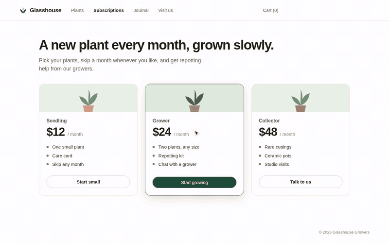
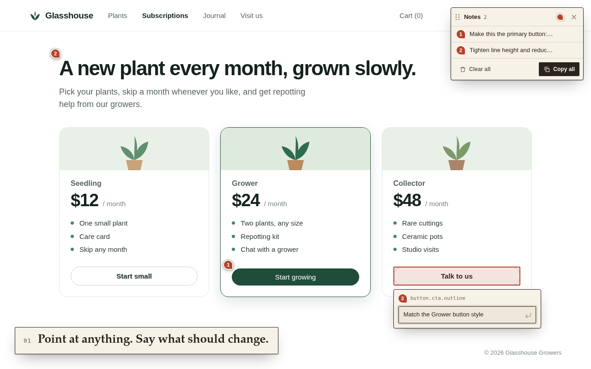
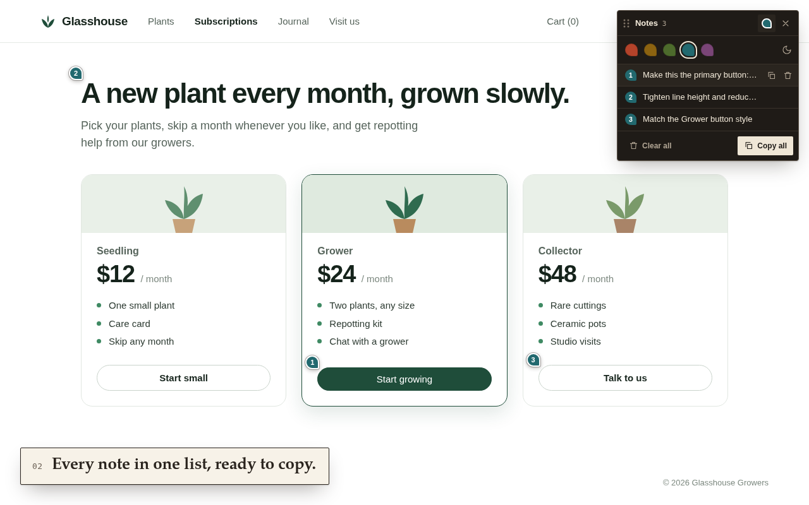
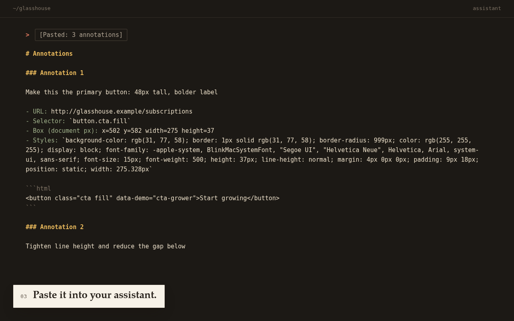

<p><picture>
  <source media="(prefers-color-scheme: dark)" srcset="store/assets/lockup-dark.png">
  
</picture></p>

Mark up a live web page like a printed proof. Point at an element, say what should change, and hand your AI coding assistant exactly what it needs to find it.



"Make the button bigger" is hard to act on without the page in front of you. Poke UI turns each remark into a small, precise bug report: your note plus the element's CSS selector, box, key styles and HTML. Copy one note or all of them as markdown and paste them into Claude Code, Codex, Cursor or any other assistant.

It runs only on the tab where you click its icon, needs no access to your sites at install, and keeps every note in your browser.

## Install

A plain-JS Manifest V3 extension with no build step, for Chromium-based browsers such as Chrome and Brave.

1. Clone this repo.
2. Open `chrome://extensions` (or `brave://extensions`) and turn on **Developer mode**.
3. Click **Load unpacked** and select the repo folder.

## Use

Click the Poke UI icon in the toolbar (pin it from the extensions menu if it's hidden). The panel opens on that tab.

### <samp>01</samp> Point at anything. Say what should change.



Click any element. The editor shows the note's number and the element's selector. Type the change and press <kbd>Enter</kbd> to save or <kbd>Esc</kbd> to cancel; <kbd>Shift</kbd>+<kbd>Enter</kbd> adds a line break. Each note becomes a numbered pin on its element; click a pin to reopen the note.

### <samp>02</samp> Every note in one list, ready to copy.



The panel lists the page's notes with their count. Click a row to edit that note; hover it to copy or delete just that one. **Clear all** and each delete ask for a second click first. A note whose element is gone is shown struck through.

The tag in the header picks the marker color, Rust, Ochre, Moss, Teal or Plum, and tints the toolbar icon to match. The button at the end of that row cycles the theme: Auto (follows the browser), Light, Dark. Drag the panel by its grip. **Done** leaves annotation mode; the pins stay, and clicking one brings the panel back.

### <samp>03</samp> Paste it into your assistant.



**Copy all** puts every note on the page on the clipboard as one markdown document.

## What you paste

````markdown
# Annotations

### Annotation 1

Make this the primary button: 48px tall, bolder label

- URL: http://glasshouse.example/subscriptions
- Selector: `button.cta.fill`
- Box (document px): x=502 y=582 width=275 height=37
- Styles: `background-color: rgb(31, 77, 58); border: 1px solid rgb(31, 77, 58); border-radius: 999px; color: rgb(255, 255, 255); display: block; font-family: -apple-system, BlinkMacSystemFont, "Segoe UI", "Helvetica Neue", Helvetica, Arial, system-ui, sans-serif; font-size: 15px; font-weight: 500; height: 37px; line-height: normal; margin: 4px 0px 0px; padding: 9px 18px; position: static; width: 275.328px`

```html
<button class="cta fill" data-demo="cta-grower">Start growing</button>
```
````

| Field | What it is |
| --- | --- |
| Note | Your text |
| URL | The full page URL |
| Selector | A CSS selector that matches only that element, anchored at a unique `id` when there is one |
| Box | Position and size in document pixels |
| Styles | 14 computed properties: color, background, font, spacing, border, display, size |
| HTML | The element's markup, cut at 400 characters |

Notes are stored per page URL (the `#hash` is ignored) and follow in-page navigation in single-page apps.

## Privacy

Everything stays in `chrome.storage.local` on your device. There are no servers, analytics, ads or remote code. Notes reach the clipboard only when you click a copy button. See [PRIVACY.md](PRIVACY.md).

| Permission | Why |
| --- | --- |
| `activeTab` | Temporary access to the current tab, granted only when you click the icon |
| `scripting` | Injects the annotation script into that tab at that moment |
| `storage` | Saves notes, marker color and theme on your device |

There are no host permissions and no content script, so the browser shows no "read and change all your data on all websites" warning at install. The flip side: after a full page reload the pins stay hidden until you click the icon on that page again. The notes are still saved. Browsers do not allow extensions on internal pages such as `chrome://` or the Chrome Web Store.

## Development

```sh
npm install
PLAYWRIGHT_CHROMIUM_EXECUTABLE_PATH=/run/current-system/sw/bin/chromium npm test
```

The tests load the extension in headless Chromium. The env var is only needed on NixOS; elsewhere `npm test` uses Playwright's own Chromium.

| Command | Does |
| --- | --- |
| `npm test` | Playwright end-to-end tests (`tests/`) |
| `npm run package` | Builds `dist/poke-ui-<version>.zip` with only the runtime files |
| `npm run store-assets` | Regenerates the three screenshots, the promo tile and this README's header lockup in `store/assets/` |
| `npm run demo-video` | Records `store/assets/demo.mp4` (with title and end cards) and `demo.gif` (the demo only, at most 3 MB); needs `ffmpeg` |
| `icons/build.sh` | Regenerates the logo, store icon and toolbar icons (needs `node`, `inkscape`, ImageMagick) |

The asset scripts drive the real extension against a fictional plant shop (`store/demo.html`, served as `glasshouse.example`), so they need the same browser setup as the tests. `store/stage.mjs` serves the scenes and loads the extension; `store/overlay.mjs` draws the captions, cursor and click rings. The video's title and end cards are `store/card.html`, which also renders the header lockup.

```text
manifest.json    MV3 manifest
background.js    toolbar click: inject content.js into the active tab, toggle it
content.js       the whole UI (pins, panel, editor) in a shadow root, plus storage and markdown
icons/           logo, generator (logo.mjs, build.sh) and the toolbar icons, one set per pin color
tests/           Playwright tests and the fixture page
store/           Web Store listing text, scenes, asset and video scripts
scripts/         packaging
```
